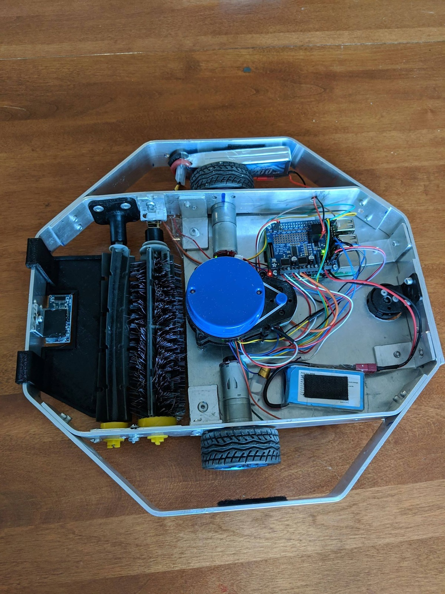
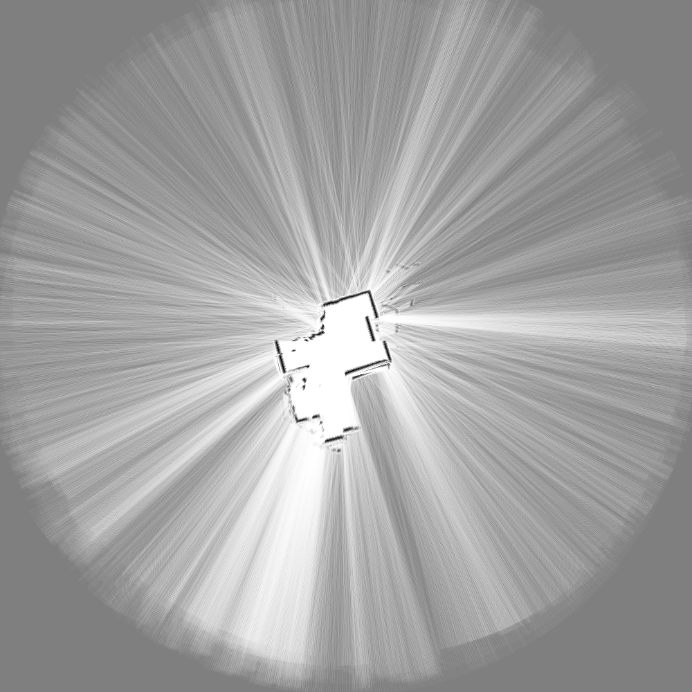
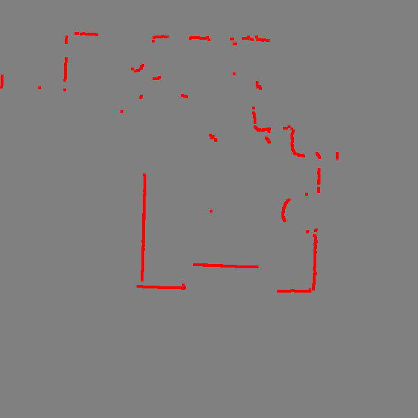

# BroomBot
BroomBot is an intelligent cleaning robot with spatial mapping.
It utilizes a LIDAR sensor and SLAM algorithm to create a map
of its environment, allowing it to plan efficient paths and
to save lots of time. This project was developed as a final year
undergraduate capstone project.



## Features

- Navigation

- Android application

- Vertical drop avoidance

- Over-the-air (OTA) updates

- Cleaning


## Project Layout

- [android-app](/android-app/src/main) - android application
- [crobot-app](/crobot-app/src/main/java/ca/uoit/crobot) - entry point
- [crobot-communication](/crobot-communication/src/main/java) - handles distributed communications
- [crobot-core](/crobot-core/src/main/java/ca/uoit/crobot) - core algorithms
- [crobot-deploy](/crobot-deploy/src/main/kotlin/ca/uoit/crobot) - update server
- [crobot-drivers](/crobot-drivers/src/main/java/ca/uoit/crobot/hardware) - device drivers


### Build Instructions

```
./gradlew build
```


## Images

#### Mobile Application


#### Map



#### Lidar


